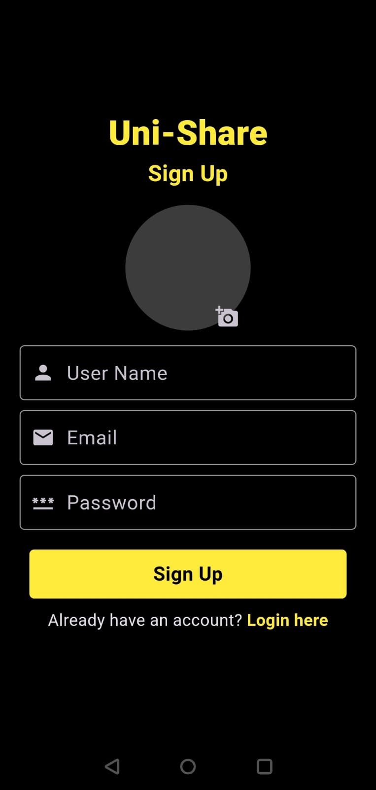
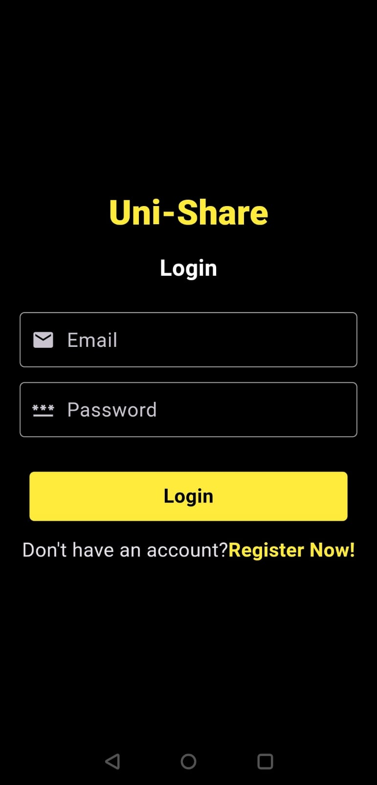

# uniShare
An flutter app which allows college students ( Bennett university for now ) to share videos related to college life with each other.

# Features
-> clean and easy to navigate ui
-> firebase authentication using email and password
-> post and view videos along with titles and caption
-> like and comment under videos
-> like comments under posts
-> message users 
-> follow and unfollow users and view their profiles and videos


## Appendix
- mvc design pattern
- getx for state management 


# Run Locally

Clone the project

```bash
  git clone https://github.com/c-o-d-e-y-o-d-a/uniShare
```

Go to the project directory

```bash
  cd uni_share
```

Install dependencies

```bash
  flutter pub get
```

Start the app

```bash
  flutter run 
```


## Screenshots





