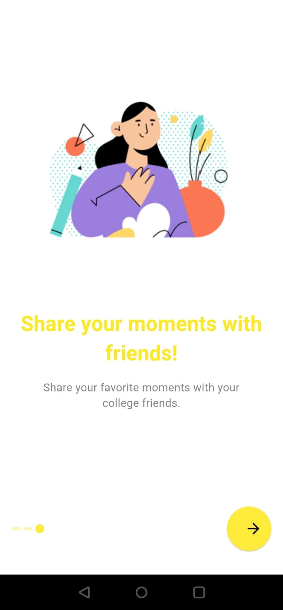
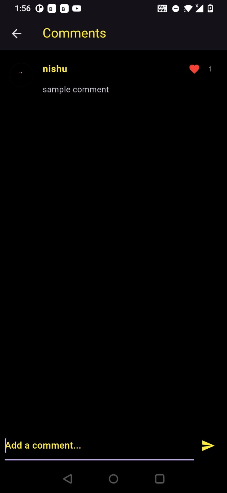

# UniShare

UniShare is a Flutter application designed specifically for college students, initially tailored for Bennett University. It facilitates seamless video sharing related to college life and offers a range of features for enhanced user interaction.

## Features

- **Clean and Easy-to-Navigate UI**: Designed for optimal user experience with intuitive navigation.
- **Firebase Authentication**: Secure access using email and password authentication through Firebase.
- **Video Posting and Viewing**: Users can post videos with titles and captions and view videos shared by others.
- **Like and Comment**: Interact with videos by liking and commenting on them.
- **Comment Likes**: Like comments under posts to express appreciation.
- **Direct Messaging**: Send messages to other users for private communication.
- **Follow and Unfollow**: Follow other users to stay updated with their posts and unfollow them when needed.
- **User Profiles**: Explore profiles of other users to view their videos and information.

## Appendix

- MVC Design Pattern: Organized code architecture following the Model-View-Controller pattern.
- GetX for State Management: Utilizes GetX for efficient and reactive state management in Flutter applications.

## Tech Stack
- Firebase authentication
- Firebase Storage
- FireStore database
- flutter


# Run Locally

Clone the project

```bash
  git clone https://github.com/c-o-d-e-y-o-d-a/uniShare
```

Go to the project directory

```bash
  cd uni_share
```

Install dependencies

```bash
  flutter pub get
```

Start the app

```bash
  flutter run 
```


## Screenshots








